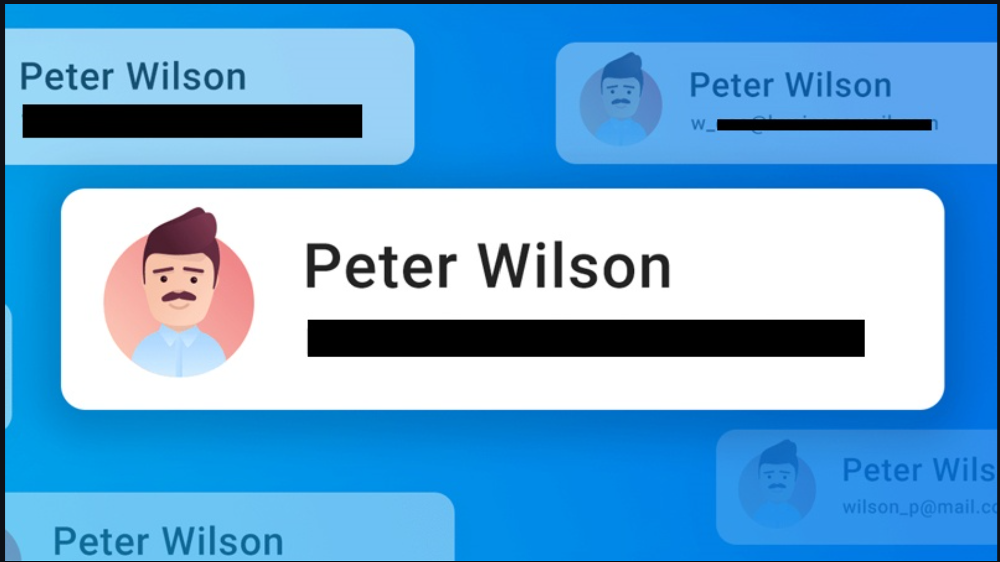

---

````markdown
# 🤖 AI Full-stack Chat App

A lightweight full-stack AI chat system built with **FastAPI + Streamlit**, supporting:
- 🗨️ Multi-turn chat with persistent history  
- 🖼️ Chat about uploaded images (with PII masking)  
- 📊 Chat about uploaded or URL-based CSV datasets  
- 🔒 Automatic PII detection, masking, and audit logging  

---

## 🧱 Features

### 💬 1. Core Chat
- Multi-turn conversation between User and Assistant  
- Markdown rendering supported  
- Chat history persisted in `app/data/memory.json`  
- Timestamps for each turn  

### 🖼️ 2. Image Chat
- Upload an image (PNG/JPG)  
- Preview displayed in chat  
- Automatic **PII masking (email, phone, name)**  
- Result saved in `SelfRAG/dataset/uploads/`  
- Audit logged to `data/pii_audit.json`

### 📊 3. CSV Data Chat
- Accepts CSV via:
  - File upload  
  - Raw GitHub CSV URL  
- Supports questions like:
  - “Summarize the dataset”
  - “Show missing values”
  - “Which column has the most missing values?”
  - “Plot histogram of price”
- Displays inline results (text, tables, or simple plots)
- Automatically **detects & masks PII** in CSV files  
- Logs PII actions to `data/pii_audit.json`

---

## 🧩 4. PII Handling System

### ✅ PII Types Detected
| Type | Regex Pattern |
|------|----------------|
| Phone | `\b\d{3}[-.]?\d{3}[-.]?\d{4}\b` |
| Email | `[A-Za-z0-9._%+-]+@[A-Za-z0-9.-]+\.[A-Z|a-z]{2,}` |
| Name | `([A-Z][a-z]+ [A-Z][a-z]+)` |

### 🧠 Audit Log Example (`data/pii_audit.json`)
```json
{
  "time": "13:03 22/10/25",
  "action": "mask_csv",
  "details": ["phone", "email", "name"]
}
````

### 💾 Chat Memory Example (`data/memory.json`)

```json
{
  "user": "Summarize the dataset",
  "bot": "Dataset có 1565 hàng và 7 cột.",
  "time": "12:53 22/10/25"
}
```

---

## 🚀 Run Locally

### 1️⃣ Clone the repo

```bash
git clone https://github.com/<your-username>/AI-Fullstack-Chat.git
cd AI-Fullstack-Chat
```

### 2️⃣ Install dependencies

```bash
pip install -r requirements.txt
```

### 3️⃣ Run backend (FastAPI)

```bash
uvicorn app.main:app --reload --port 8000
```

### 4️⃣ Run frontend (Streamlit)

```bash
streamlit run app_frontend.py
```

App runs at:
👉 [http://localhost:8501](http://localhost:8501)
Backend API at:
👉 [http://localhost:8000](http://localhost:8000)

---

## 📁 Project Structure

```
app/
├── main.py
├── routes/
│   ├── chat.py
│   ├── upload_csv.py
│   ├── upload_image.py
│   └── memory_viewer.py
├── utils/
│   ├── csv_utils.py
│   ├── image_utils.py
│   ├── llm_client.py
│   └── pii_utils.py
│
├── data/
│   ├── memory.json
│   ├── pii_audit.json
│   ├── pii_audit_summary.json
│   └── temp_*.csv
│
├── SelfRAG/
│   └── dataset/
│       └── uploads/
│
├── app_frontend.py
├── requirements.txt
└── README.md
```

---

## 🖼️ Screenshots

🎥 [Watch Full Demo Video](https://drive.google.com/file/d/1L9SSGkkwUqwXr8TanTxr-5YBmCmxSThD/view?usp=sharing)

### 💬 Chat Demo


### 📊 CSV Upload + Masking


### 🖼️ Image PII Masking



### 🔒 PII Audit Log


---

## 🧠 Tech Stack

| Layer         | Technology                                 |
| ------------- | ------------------------------------------ |
| Backend       | FastAPI, Python                            |
| Frontend      | Streamlit                                  |
| AI Utils      | PyTorch + CLIP (for next Self-RAG upgrade) |
| OCR           | Tesseract via `pytesseract`                |
| Data Handling | Pandas, Matplotlib                         |
| Persistence   | JSON-based memory & audit logging          |

---

## 💡 Future Upgrades

* Integrate **CLIP + Self-RAG** for smart image/caption retrieval
* Add **LLM summarization** for CSV or image context
* Deploy to Render / Hugging Face Spaces

---

## 🧾 Author

**A A**
AI Developer & Research Intern Candidate
📅 Submission Date: *October 23, 2025*
🚀 Built with ❤️ for the AI Full-stack Internship Assignment

## 🧾 Installation Options
You can install either:
- `requirements.txt` → minimal dependencies (for running demo)
- `requirements_full.txt` → all dependencies used during development

